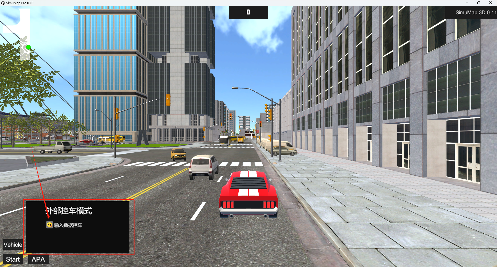

*Notice: This project was proposed by an influencer known as "Unity3D Think" (WeChat public account)*

## Demo

This is a simple demonstration of SimuMap. We can simulate the movement of the red car through an API using various programming languages (such as C++, Python, etc.). Meanwhile, we can retrieve real-time scenario information and render it as a real-time Bird's Eye View (BEV) perspective demo.

    


## Introduction

Developing a **3D Autonomous Driving Simulation platform** is a complex and dauting project.
It requires consideration of numerous aspects related to functionalities and technologies to ensure the realism and robustness of the simulation environments.
Fortunately, SimuMap has been created to meet these meets. 
This is a high-quality, free 3D autonomous driving simulation platform that supports a wide arrays of functions, including:
- Scenario Construction
- Vehicle Control 
- Traffic Rules & Behaviors
- Interactive User Interface
- Algorithm Development & Tesing
- Communication & Networking
- Openness & Extensibility
 
The detailed introduction refers to the blog ["*Unity3D Simulation Autonomous Driving Acquisition Data Platform*"](https://mp.weixin.qq.com/s/35w56EQhfesFN6XFl1Ymsg) written by [Unity3D Think](https://gitee.com/aichifan0df)

## How to manipulate a car in SimuMap
There is an open API available for developers to write code scripts to control vehicle behavior, including parameters like Steer Angle, Motor Torque, and Brake Torque. 
Developers can use [UDP](https://www.fortinet.com/resources/cyberglossary/user-datagram-protocol-udp) as the communication protocol to send these commands to the target vehicle.

Here is a basic example of a code script for controlling a vehicle using UDP communication, written in Python:

    ```python
    import socket
    import metaX_pb2  # 导入生成的 protobuf 模块
    import time

    # 创建 UDP 套接字
    udp_client = socket.socket(socket.AF_INET, socket.SOCK_DGRAM)

    # 目标 IP 和端口（根据你的配置）
    target_ip = "127.0.0.1"
    target_port = 9001

    # 初始化控制参数
    steer_angle = 0.0  # 初始转向角度
    motor_torque = 30.0  # 初始驱动力
    brake_torque = 0.0  # 初始制动力

    # 动态调整的循环
    try:
        while True:
            # 根据某种条件调整转向角度 (示例：模拟逐渐左转)
            # 可以根据实际需求来动态计算 steer_angle，比如从 0.0 增加到 -30.0
            steer_angle -= 1.0  # 每次循环调整 -1 度
            if steer_angle < -30.0:  # 限制最大转向角度
                steer_angle = -30.0

            # 创建新的 VehicleMotion 数据
            event_data = metaX_pb2.EventData()
            event_data.type = "VehicleMotion"

            vehicle_motion = metaX_pb2.VehicleMotion()
            vehicle_motion.steerAngle = steer_angle
            vehicle_motion.motorTorque = motor_torque
            vehicle_motion.brakeTorque = brake_torque

            # 序列化数据并赋值给 payload
            event_data.payload = vehicle_motion.SerializeToString()

            # 序列化整个 EventData
            serialized_data = event_data.SerializeToString()

            # 发送数据到 SimuMap3D Pro
            udp_client.sendto(serialized_data, (target_ip, target_port))

            # 打印调试信息
            print(f"Sending steerAngle: {steer_angle}")

            # 控制频率（每 0.1 秒调整一次）
            time.sleep(0.1)

    except KeyboardInterrupt:
        print("Dynamic control stopped.")

    finally:
        # 关闭套接字
        udp_client.close()
    ```


Before running this code, you need install the [`socket`](https://docs.python.org/3/library/socket.html) library, which enables communication based on UDP.

In my code, **metaX_pb2** is a Protocol Buffer 3 library tailored for SimuMap. The detailed protocol content is as follows:

```
syntax = "proto3";

package Simulation.Data;

message EventData{
 //type ="FrameData";type="FreeSpaceRoadBound";type="TrafficLightInfo";
 string type=1;
 bytes payload=2;
}

message FrameData{
  int32 frameID = 1;
  //trackBoxs:动态障碍物
  repeated TrackBox trackBoxs= 2;
  //lans:车道线
  repeated Lane lans= 3;
  int32 speed = 4;
}

message FreeSpaceRoadBound{
  //boundData 道路区域 256*256*3二值化图像
  bytes boundData = 1;
}

message PointCloudV3Data{
  //pointClouds:点云
  repeated PointCloudV3 pointClouds= 1;
}

message TrafficLightInfo{
  //lightInfo:红绿灯
  repeated TrafficLight lightInfo = 1;
}

message VehicleMotion{
  //前轮转向角度
  float steerAngle = 1;
  //后轮驱动力
  float motorTorque = 2;
  //制动 默认0不制动
  float brakeTorque = 3;
}

message APAData{
   repeated ParkInfo apaParks = 1;
}

message ParkInfo{
  int32 id = 1;
  int32 number = 2;
  OccupyStatus status = 3;
  repeated PointV3 BoundingBoxs = 4;
  TypePark parkType = 5;
  
  enum OccupyStatus{
   //未知状态
   unknown = 0;
   //空闲状态
   free = 1;
   //占用状态
   Occupied = 2;
   //选择可入库状态
   destination = 3;
  }
  enum TypePark{
    unknownPark = 0;
	//垂直库位
    VerticalPark = 1;
	//水平库位
    HorizontalPark = 2;
  }
}

message PointV3{
 float x = 1;
 float y = 2;
 float z= 3;
}
message PointV2{
 float x = 1;
 float y = 2;
}
message PointCloudV3{
  PointV3 coord= 1;
  int32 type = 2;
}

message TrackBox{
  int32 objID= 1;
  //CarType
  int32 type= 2;
  //车辆坐标
  PointV3 centerPos= 3;
  //车辆朝向
  float heading= 4;
  float length= 5;
  float width= 6;
  float height= 7;
}

message Lane{
  // 1 虚车道线，2 行人斑马线，3 道路边界线，4 左右车道中间分界线（黄实线）
  int32 type = 1;
  repeated PointV2 points = 2;
}

message VehicleInfo{
  int32 speed = 1;
  float heading = 2;
  PointV3 VehicleWorldCoordinates= 3;
}

message TrafficLight{
  int32 status = 1;
  float x = 2;
  float y = 3;
  float z = 4;
}
enum CarType
{
    unknown = 0;
    bus = 1;
    car = 2;
    fiat = 3;
    furgao = 4;
    truck = 5;
}
```
To transfer and use the available library in Python, you should install the [protobuf](https://github.com/protocolbuffers/protobuf/releases) library to handle the serialization of data according to this protocol content. Python modules can be generated using the following commands in `Terminal Command`

```
bash
protoc --python_out=. metaX.proto
```
This will generate a meta_X_pb2.py file, which you can import in Python.

Finally, please remember to enable the API button in SimuMap.



## Did you find this page helpful? Consider sharing it 🙌
