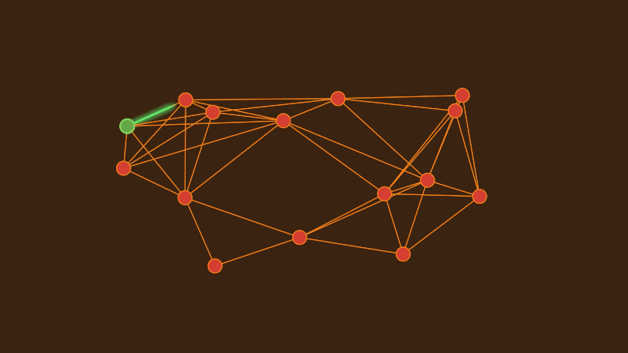
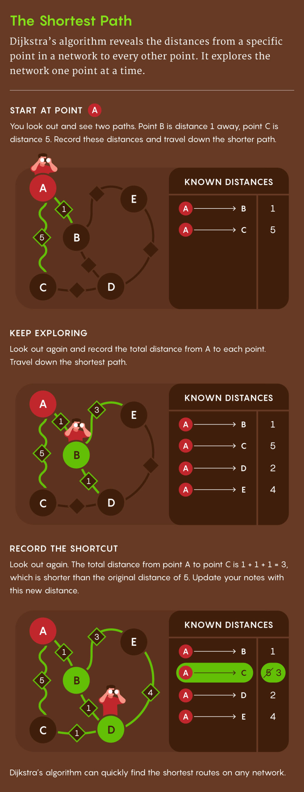

## [Computer Scientists Establish the Best Way to Traverse a Graph](https://www.quantamagazine.org/computer-scientists-establish-the-best-way-to-traverse-a-graph-20241025/) 


*Dijkstra’s algorithm was long thought to be the most efficient way to find a graph’s best routes. Researchers have now proved that it’s “universally optimal.”*

<center>
    
    <br>
    <div style="color:orange; border-bottom: 1px solid #d9d9d9;
    display: inline-block;
    color: #999;
    padding: 2px;">
    Image source: Quantamagzine
  	</div>
</center>

### A simple example for Dijkstra algorithm
The method of Dijkstra algorithm to find the shotest route can be divided into four steps:
- **Start at point** Select starting point A. Calculate the distance from A to a neighboring point, e.g. the distance to B is i and the distance to C is 5. Choose the shorter route, that is, go to B.
- **Keep exploring** From the new point (B) continue to find the distance of the adjacent points, and add these distances to the distance from A to B. For example, the distance from A to B is 1, and the distance from B to D is 1, so the total distance from A to D is 2(1+1=2). Update the shortest known path.
- **record the shortcut** Update the record when a shorter path is found during exploration. For example, the original distance from A to C is 5, but the total distance from the paths through B and D to C is 3(1+1+1=3), which is shorter than the original distance, so updating A to C has a distance of 3. 
- **Iterate until visit all points** The algorithm continues to traverse until the shortest path of all nodes is determined. Each time the shortest distance path is first selected for the next calculation, and the shortest path to each point is gradually optimized.

<center>
    
    <br>
    <div style="color:orange; border-bottom: 1px solid #d9d9d9;
    display: inline-block;
    color: #999;
    padding: 2px;">
    Image source: Mark Belan/ Quanta Magazine
  	</div>
</center>

Ultimately, Dijkstra's algorithm can quickly find the shortest path from the starting point to all other nodes in the network.

### Here's a simple overview of Dijkstra's Algorithm in pseudocode
```
function Dijkstra(Graph, source):
    create vertex set Q
    for each vertex v in Graph:
        dist[v] ← INFINITY
        prev[v] ← UNDEFINED
        add v to Q
    dist[source] ← 0

    while Q is not empty:
        u ← vertex in Q with min dist[u]
        remove u from Q
        
        for each neighbor v of u:           // only v that are still in Q
            alt ← dist[u] + length(u, v)
            if alt < dist[v]:               // A shorter path to v has been found
                dist[v] ← alt 
                prev[v] ← u

    return dist[], prev[]
```

### What is the new breakthrough?
In the original Dijkstra paper, a simple and crucial data structure, called [**Heap**](#r-3), was used, which left room for improvement by later scientists. 

In 1984, for example, two computer scientists devised a clever heap data structure that allowed the Dijkstra algorithm to reach its theoretical limit, or lower bound, on the time needed to solve the shortest path problem for a single source. 

In a certain sense, this version of Dijkstra's algorithm has been arguably the best and has been a "standard" for nearly 40 years. In this [latest paper](#r-1), the breathrough is still the heap data structure. Because they found that the commonly used data structures, such as [Fibonacci heap](#r-4), have good worst-case time complexity theoretically, but in many cases can not make full use of the local structure. This results in high computational cost when dealing with certain types of graphs.

However， if the ability to quickly access recent inserts is added to the heap designed in 1984, the efficiency of the algorithm can be significantly improved. To do this, researchers propose a new heap data structure with special "Working Set Property".

The so-called "Working Set Property" means that the heap can take full advantage of the locality of the operation, so that the most recently inserted element is preferentially processed, reducing the cost of extracting the smallest elements.


Reference

<a id="r-4"></a>[GeeksForGeeks. (2024). Fibonacci Heap.](https://www.geeksforgeeks.org/fibonacci-heap-set-1-introduction/)

<a id="r-3"></a>[GeeksForGeeks. (2024). Heap Data Structure](https://www.geeksforgeeks.org/heap-data-structure/)

<a id="r-1"></a>[Haeupler, B., Hladík, R., Rozhoň, V., Tarjan, R., Tětek, J. (2024). Universal Optimality of Dijkstra via Beyond-Worst-Case Heaps](https://arxiv.org/abs/2311.11793)


<a id="r-2"></a>[量子位. (2024). 本科经典算法Dijkstra，被证明是普遍最优了：最坏情况性能也最优!](https://mp.weixin.qq.com/s/V0MlmsoZdcRIZcxsRgAzuA)


