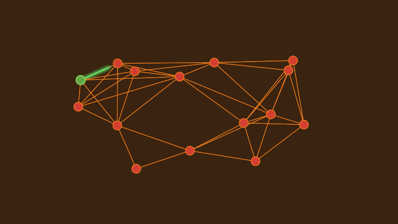

## [Computer Scientists Establish the Best Way to Traverse a Graph](https://www.quantamagazine.org/computer-scientists-establish-the-best-way-to-traverse-a-graph-20241025/) 

*Dijkstra’s algorithm was long thought to be the most efficient way to find a graph’s best routes. Researchers have now proved that it’s “universally optimal.”*

Image source: Quantamagzine

