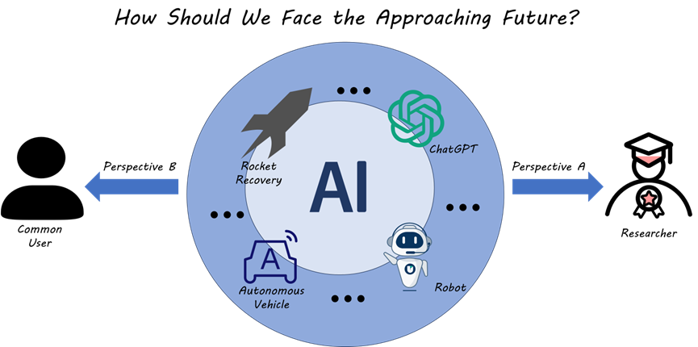

Nowadays, plenty of edge-cutting reports and news pour into our life frequently and hundreds and thousands advanced AI applications (e.g. Autonomous Vehicle, GPT-4o, AI Apps, etc.) employed in our daily lives are emerging like bamboo shoots after a spring rain. Looking around our surroundings, we can see that our lifestyle has changed significantly due to these new technologies compared to ten years ago, or even just yesterday.

Ten years ago, we cannot image that vehicles can be operated by themselves, but recently the driver-less taxi, Apollo Go, have begun operating on the urban road in Wuhan. Ten years ago, we were convinced that recycling space vehicles was impossible and nonsensical, yet Elon Musk broke this skepticism and succeeded in launching the Falcon 9 rocket, successfully recovering its first stage 10 minutes after liftoff in 2015. Ten years ago, we were captivated by the idea of an AI assistant that could quickly learn human knowledge and provide valuable advice to its user, like Javis in the Marvel movie The Iron Man. However, ChatGPT was born on October 11, 2022, and in just seventeen months, OpenAI delivered a super AI from science fiction movies, called GPT-4o. All these emerging technologies make me both very excited and spontaneously reflective. As a human born in the late 20th century, what can I do something for this great era. Maybe I can explore this question from two perspectives according to my different social identities.

Firstly, as a scientific researcher, even though I am currently a student, I aspire to make people’s lives more convenient and comfortable. With my major in transportation engineering during both my undergraduate and graduate studies, I believe that sustainable urban development combined with wise planning is essential for our society to sustain human civilization. Throughout human history, it is not hard to notice that every time advanced technology emerges, our productivity is rapidly enhanced and our efficiency in handling tasks gradually improves. Although this brings us numerous benefits in various fields such as transport, communication, and space exploration, our environment faces unprecedented pressure from global warming. Additionally, our energy usage is confronted with many restrictions, such as the inefficiency of solar power compared to fossil fuels, the safety concerns of hydrogen energy, and the scarcity of oil. Therefore, despite the seemingly insurmountable challenges we face at present, I hope to make an effort within my field to create cities that are more eco-friendly and vibrant.

What is my vision for the future city? The first keyword that comes to mind is ‘smart’. I foresee our cities becoming increasingly digitalized and virtualized. During this process, data is the lifeblood of AI, and the vast amounts of data generated by humans can significantly propel the development of artificial general intelligence (AGI). For instance, consider human mobility: every day, people travel around their cities, generating a wealth of behavioral data. Although this data may initially appear random and undifferentiated, sophisticated AI systems can uncover valuable underlying patterns through collaboration with humans. These insights can facilitate precise predictions of human behavior, thereby enhancing the efficiency of urban management. Another crucial aspect of my vision is ‘green’. Future urban environments must harmoniously integrate with nature, creating spaces where humans and animals can coexist. In the field of urban planning, there is a growing focus on green building projects that incorporate natural elements alongside traditional materials like concrete. Singapore exemplifies this approach with its environmentally friendly urban planning. Consequently, the trajectory of future cities will be towards greater digitalization and ecological sustainability. For me, it is imperative to engage in research within these domains to contribute to the realization of such a future.

Another perspective on the AI era comes from my own experience as a user of AI applications. With the continuous emergence of various AI-powered applications, our daily lives are being transformed to a significant extent. For example, GPT excels in programming, placing traditional coding workers in a situation where their jobs could be replaced by AI at any moment. What’s more, Apollo Go has recently received qualification to operate in Wuhan, causing many taxi drivers and ride-hailing drivers to face a significant reduction in customer orders. This greatly impacts their livelihoods and interests. I argue that such phenomena, where advanced AI replaces traditional jobs, will continue to emerge. This is an inevitable trend of societal and technological development. So, how should we respond to this?

I believe the most important aspect is that we should not be overpowered by our technology, but rather empowered by it. This means we should utilize these AI tools as virtual partners rather than completely relying on their output without any independent thought. The process should resemble a collaboration where humans are the idea providers and AI acts as the implementers. This relationship can maintain a healthy cycle in which users continue to learn rather than relinquishing their capacity for independent thought.

To sum up, the aforementioned opinions reflect my current thoughts. Due to the limitations of my own understanding, these ideas may not be entirely correct for everybody. However, I am highly optimistic about the development of AI and hope to integrate AI into my research and life in a collaborative manner.
