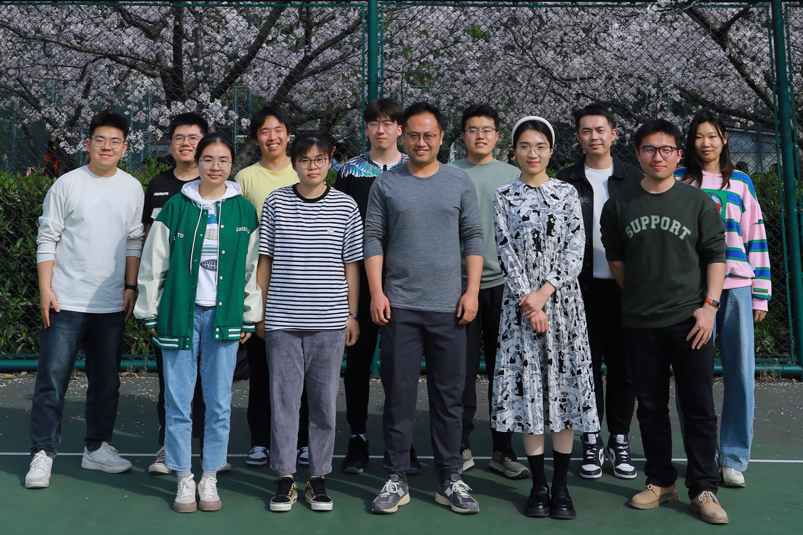

## Outstanding Members of the STSS Lab
#### Spatio-Temporal Smart Sensing Lab

## Memorable Experience at Huang's Lab

## My Vibrant Friends

At TJU, I made friends with three remarkable individuals. **Mr. Zhefeng** is the most confident and assertive person I have ever met. Whenever I communicate with him, I absorb the positive energy he radiates, and I often find myself shedding negative emotions after our conversations. In summary, he is someone who inspires my motivation and boosts my self-confidence.

My next friend is **Haoyang**, who was my first roommate at the Jiading campus of TJU. He is the kindest and friendliest person I know. He has proven to be an excellent collaborator on group projects, such as the Urban Transportation Challenge Week from the master’s class and the Huawei Mathematical Modeling Competition. He is a warm-hearted group leader.

The last, but certainly not least, person I met is **Haoran**, a stylish and handsome boy from Dongbei. He possesses impressive skills, including calligraphy, basketball, and the ability to attract many admirers. He also played a significant role in igniting my passion for reading through the WeChat Read app.

As time flies by, with three years feeling like just a moment, it’s now time to bid farewell to my amazing friends. Let us look forward to reuniting in our next golden era.

## Beloved Girlfriend
I am very fortunate to have found my girlfriend during my most uncertain times on August 8, 2021. I am grateful for her constant encouragement and companionship. I love you deeply, and may God bless us.

## The Most Patient and Positive Parent
I am deeply grateful for my parents' immense love and support over the past years. I will cherish them forever and send my best wishes to them.
