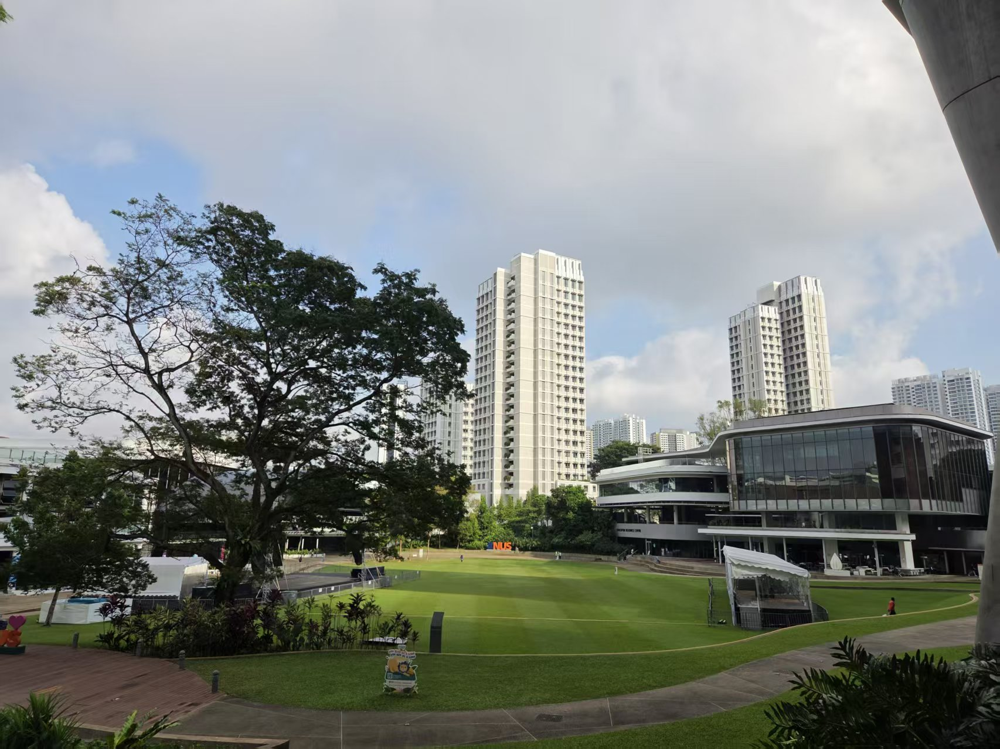
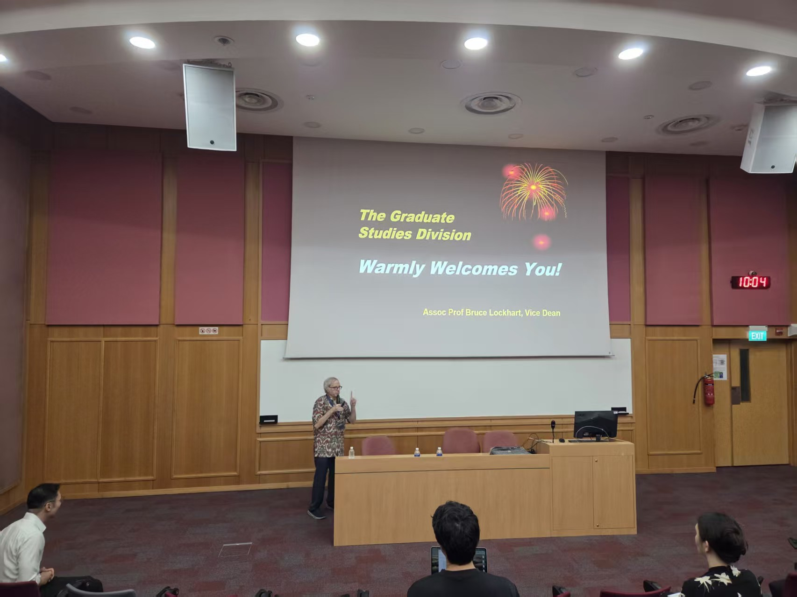

#### New Start, New Environment, New People

Hi everyone,

I’m excited to share a little about my first academic year at NUS. Joining this vibrant community has been a real honor, and as this is my first time studying outside of China, every day feels like a fresh adventure.

Singapore has been full of pleasant surprises — warm and friendly people, an amazing variety of tasty food, and a lush, eco-friendly environment that’s a joy to explore. If I had to name one challenge, it would be the weather. The heat here is no joke, and sometimes it feels like the humidity and I are in a constant wrestling match — with sweat winning every round!

Still, this journey at NUS is just beginning. I’m eager to dive deeper into my research, expand my perspectives, and, in the long run, contribute something meaningful that can help move human society forward in a positive way.

Here are a few pictures of my awesome captures from my enrolment week!

