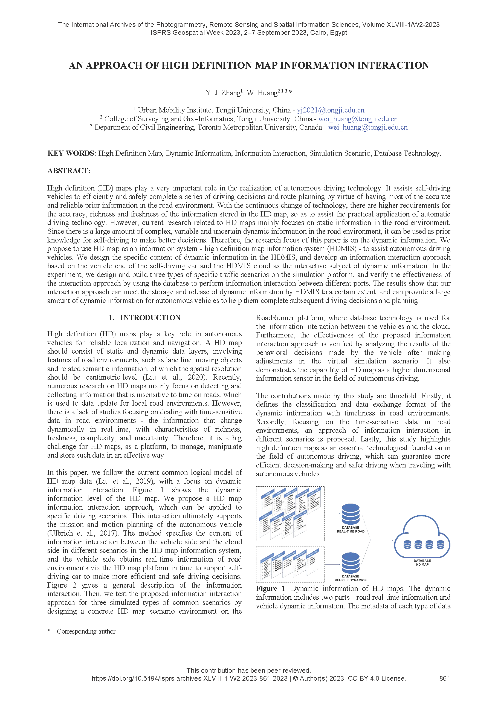

This is an opportunity to showcase the results of our team's phased research work. We first submitted an abstract to participate in this conference, and after the conference, we submitted the full paper. 

The research primarily focuses on the initial exploration of high-definition map information interaction approach. The full article is now available at [here](https://isprs-archives.copernicus.org/articles/XLVIII-1-W2-2023/861/2023/).

Welcome to read and feel free to communicate!

