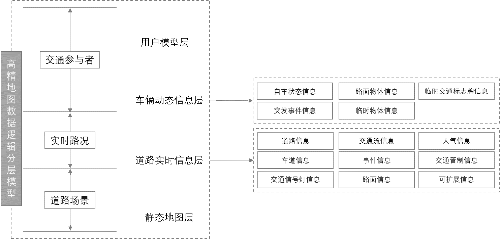

#### This work is driven by the results in my [previous paper](/publication/journal-article/) on HD Map.
The group standard titled "Dynamic Data Interaction Patterns and Contents of High Definition Maps for Autonomous Driving" was jointly developed by a team led by Professor Liu Chun, Professor Huang Wei, and Associate Professor Wu Hangbin from the School of Surveying and Geospatial Information at Tongji University. The project involved collaboration with multiple universities, including Wuhan University, Wuhan University of Technology, Sun Yat-sen University, Changsha University of Science and Technology, and Beijing University of Civil Engineering and Architecture, as well as numerous enterprises and institutions. These include Nanjing Institute of Surveying, Mapping and Geotechnical Investigation Co., Ltd., Guangdong Provincial Map Institute, Shanghai Yodao Zhitu Technology Co., Ltd., Shenyang Meixing Technology Co., Ltd., Liaoning Hontal Map Technology Co., Ltd., Intelligent Map (Beijing) Technology Co., Ltd., Beijing Langge Technology Co., Ltd., Shenzhen Kaelide Technology Co., Ltd., Hebei Quandao Technology Co., Ltd., Wuhan Zhonghaiting Data Technology Co., Ltd., Yiren (Shanghai) Technology Co., Ltd., Chongqing Changan Automobile Co., Ltd., Intelligent Timespace Technology (Anqing) Co., Ltd., Shanghai Institute of Surveying and Mapping, SAIC Motor Corporation Limited, Duomin Intelligent Technology (Suzhou) Co., Ltd., Tongfan Surveying and Engineering Technology Co., Ltd., China Mobile (Shanghai) Information and Communication Technology Co., Ltd., Western Science City Intelligent Connected Vehicle Innovation Center (Chongqing) Co., Ltd., and Dongfeng Yuexiang Technology Co., Ltd., among others.

This standard, which has been assigned the designation **T/CSGPC 024-2024**, was officially approved for release and implementation on April 16, 2024.

### The background of the standard development
High-definition maps are a crucial component for achieving autonomous driving and are expected to become a primary form of future digital transportation infrastructure. These maps play a significant and influential role in transforming transportation methods, enhancing travel safety, reducing environmental pollution, and facilitating the transition to fully autonomous driving. In 2022, the Ministry of Natural Resources issued several important notices, including the "Notice on the Pilot Work for the Application of High-Definition Maps in Intelligent Connected Vehicles" and the "Notice on Promoting the Development of Intelligent Connected Vehicles and Safeguarding the Security of Surveying and Mapping Geographic Information." These publications brought the future development of high-definition maps, as well as data compliance issues, into sharp focus across the automotive and mapping industries. Due to the physical limitations of sensors and the complex road environments in China, in-vehicle perception systems struggle to obtain beyond-line-of-sight information, making it difficult to acquire crucial real-time data required for advanced autonomous driving navigation and decision-making. Therefore, high-definition maps are particularly important in autonomous driving systems, demanding higher data quality in terms of the variety and accuracy of information compared to traditional navigation electronic maps.

### Purpose and Significance of the Standard Development
Currently, the industry has developed several national and local standards for the static information of high precision road maps. However, there is a notable lack of standards and guidelines addressing the dynamic information layer, which is characterized by its timeliness in the road traffic environment. This standard, therefore, focuses on the dynamic information that should be included in high-definition maps for autonomous driving. It specifies the basic requirements for information exchange, interaction models, real-time road information exchange content, and dynamic vehicle information exchange content, aiming to be applicable to information exchange in fields related to high-definition maps for autonomous driving.

### Main Content of the Standard
Based on the attributes and characteristics of map elements, high-definition maps can be divided into the following layers: static map layer, real-time road information layer, dynamic vehicle information layer, and user model layer, as illustrated in the accompanying diagram. This document primarily addresses the specifications related to the real-time road information layer and the dynamic vehicle information layer.

The dynamic data in high-definition maps should include both real-time road information and dynamic vehicle information. The real-time road information is categorized into road information, lane information, traffic signal information, traffic flow information, event information, road surface information, weather information, traffic control information, and extensible information. The dynamic vehicle information should include data processed by the vehicle's perception system, such as the vehicle's status, road surface objects, temporary traffic signs, unexpected events, and temporary objects.

#### This standard was supported by the National Key R&D Program project "Long-term Effectiveness, Dynamic Updating, and Interaction Mechanism of High-Definition Maps."

Click [Here](https://mp.weixin.qq.com/s/b47emwqfOyURpfWDo73EnA) for the source post.

